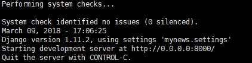
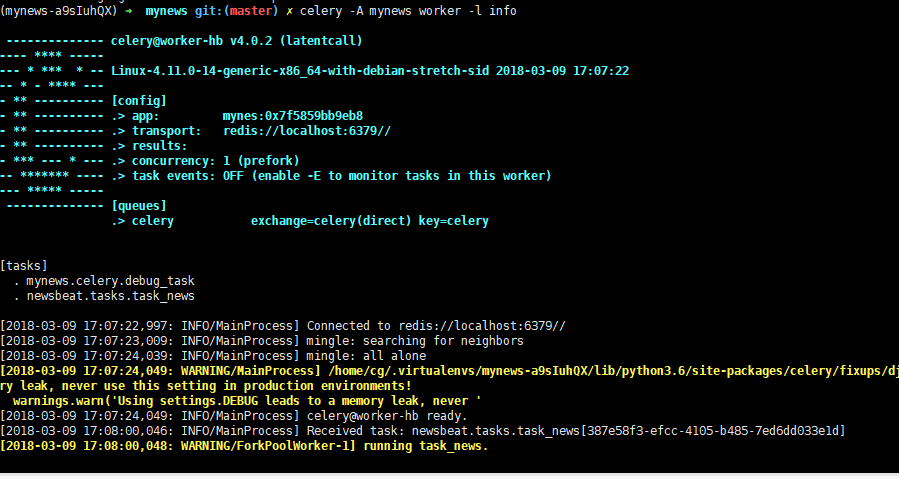
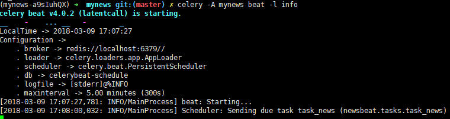
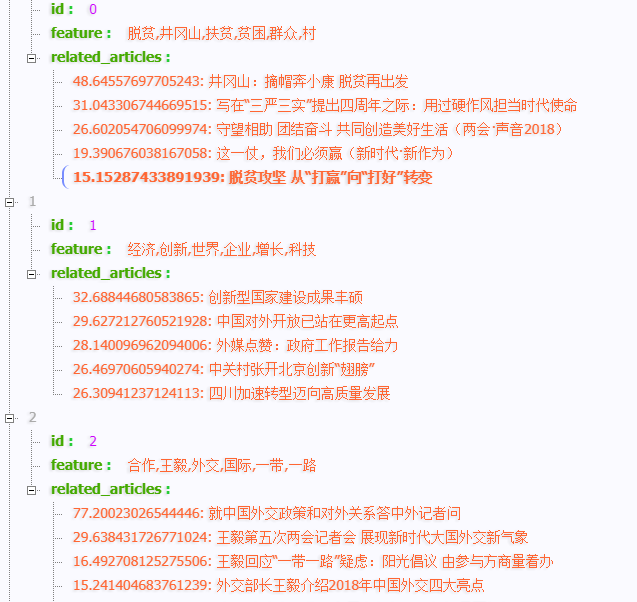

# NewsExtract

Extract News of main streams of China.
中文新闻topic提取

packages:
- python=3.6
- celery=4.0.2
- django=1.11.2
- numpy=1.14.2
- feedparser=5.2.1
- django-celery-results=1.0.1
- redis=2.10.6
- djangorestframework=3.7.7

on Ubuntu16.04

## 目录

* [开始](#开始)
  * [clone项目](#clone项目)
  * [安装项目依赖](#安装项目依赖)
  * [配置setttings](#配置settings)
  * [运行](#初次运行)
* [访问页面](#访问页面)
* [进一步](#进一步)

## 开始

### clone项目

```
git clone https://github.com/CodeXTeam/NewsExtract.git
```

`cd mynews`

`NewsExtract/mynews`是项目根目录

### 安装项目依赖

`pipenv install`

`pipenv`用法请参考[Pipenv](https://github.com/cgDeepLearn/LinuxSetups/blob/master/docs/python-lib/Pipenv.md)

### 配置settings

`NewsExtract/mynews/mynews.settings.py`

- 配置数据库和celery， ALLOWED_HOST修改成你的

```conf
from celery.schedules import crontab

# Celery application definition
# http://docs.celeryproject.org/en/v4.0.2/userguide/configuration.html

CELERY_BROKER_URL = 'redis://localhost:6379/1'  # 更换成你的,最好设置redis密码和单独的数据库号
CELERY_RESULT_BACKEND = 'django-db'
CELERY_ACCEPT_CONTENT = ['application/json']
CELERY_RESULT_SERIALIZER = 'json'
CELERY_TASK_SERIALIZER = 'json'
CELERY_TIMEZONE = 'Asia/Shanghai'  # 与django中TIMEZONE相同=TIMEZONE就可以
CELERY_BEAT_SCHEDULE = {
    'task_news': {
        'task': 'newsbeat.tasks.task_news',
        'schedule': crontab(minute='1', hour='9,22') # 每天9点和22点 1分定时执行
    }
}
```

### 初次运行

- 初始化(项目根目录NewsExtract/mynews执行),没有激活环境请键入`pipenv shell`

```shell
python manage.py migrate
python manage.py createsuperuser
```

- 依次在根目录(NewsExtract/mynews)下运行django和celery(开三个终端)：

```python
python manage.py runserver 0.0.0.0:8000 # t1
celery -A mynews worker -l info  # t2 celery worker
celery -A mynews beat -l info  #  t3 celery beat
```

- then go get it

如果你想在现在的时间执行定时任务,请修改settings.py中的shedule时间

- 三个终端显示结果示例
  - 终端1

    

  - 终端2

    

  - 终端3

    

- news的非负因式矩阵分解可能需要几分钟到十几分钟，请耐心等待

## 访问页面

浏览器键入`localhost:8000/` 显示Home  (localhost可以换成你服务器ip)

键入`localhost:8000/news/` 显示如下api



访问`localhost:8000/admin`·，输入之前`createsuperuser`的用户密码,在`DjangoCeleryResults`下可以看到`TaskResult`
点击进去即可查看任务执行情况

## 进一步

- 页面优化
- 算法优化