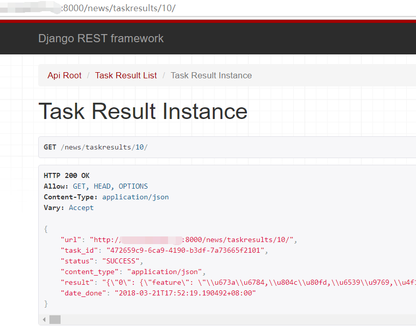

# NewsExtract

Extract News of main streams of China.\
中(英)文 feed源 topic提取 :smile:
---
packages:
- python=3.6
- celery=4.0.2
- django=1.11.2
- numpy=1.14.2
- feedparser=5.2.1
- django-celery-results=1.0.1
- redis=2.10.6
- djangorestframework=3.7.7
- scipy=1.0.1
- scikit-learn=0.19.1
- django-calendarium=1.3.4


on Ubuntu16.04


## 目录

* [开始](#开始)
  * [clone项目](#clone项目)
  * [安装项目依赖](#安装项目依赖)
  * [配置setttings](#配置settings)
  * [运行](#初次运行)
* [访问页面](#访问页面)
* [进一步](#进一步)

## 开始

### clone项目

```
git clone https://github.com/CodeXTeam/NewsExtract.git
```

`cd mynews`

`NewsExtract/mynews`是项目根目录

### 安装项目依赖

`pipenv install`

`pipenv`用法请参考[Pipenv](https://github.com/cgDeepLearn/LinuxSetups/blob/master/docs/python-lib/Pipenv.md)

#### pipenv graph

django-calendarium==1.3.4
  - django [required: >=1.6, installed: 1.11.2]
    - pytz [required: Any, installed: 2018.3]
  - django-filer [required: Any, installed: 1.3.0]
    - Django [required: <1.11.999,>=1.8, installed: 1.11.2]
      - pytz [required: Any, installed: 2018.3]
    - django-mptt [required: >=0.6,<0.9, installed: 0.8.7]
    - django-polymorphic [required: >=0.7,<1.4, installed: 1.3]
    - easy-thumbnails [required: >=2,<2.5, installed: 2.4.2]
      - django [required: >=1.4.2, installed: 1.11.2]
        - pytz [required: Any, installed: 2018.3]
      - pillow [required: Any, installed: 5.0.0]
    - Unidecode [required: >=0.04,<0.05, installed: 0.4.21]
  - django-libs [required: Any, installed: 1.67.13]
  - python-dateutil [required: Any, installed: 2.7.2]
    - six [required: >=1.5, installed: 1.11.0]
django-celery-results==1.0.1
  - celery [required: <5.0,>=4.0, installed: 4.0.2]
    - billiard [required: >=3.5.0.2,<3.6.0, installed: 3.5.0.3]
    - kombu [required: <5.0,>=4.0.2, installed: 4.1.0]
      - amqp [required: >=2.1.4,<3.0, installed: 2.2.2]
        - vine [required: >=1.1.3, installed: 1.1.4]
    - pytz [required: >dev, installed: 2018.3]
djangorestframework==3.7.7
feedparser==5.2.1
jieba==0.39
redis==2.10.6
scikit-learn==0.19.1
scipy==1.0.1
  - numpy [required: >=1.8.2, installed: 1.14.2]

### 配置settings

`NewsExtract/mynews/mynews.settings.py`

- 配置数据库和celery， ALLOWED_HOST修改成你的

```conf
from celery.schedules import crontab

# Celery application definition
# http://docs.celeryproject.org/en/v4.0.2/userguide/configuration.html

CELERY_BROKER_URL = 'redis://localhost:6379/1'  # 更换成你的,最好设置redis密码和单独的数据库号
CELERY_RESULT_BACKEND = 'django-db'
CELERY_ACCEPT_CONTENT = ['application/json']
CELERY_RESULT_SERIALIZER = 'json'
CELERY_TASK_SERIALIZER = 'json'
CELERY_TIMEZONE = 'Asia/Shanghai'  # 与django中TIMEZONE相同=TIMEZONE就可以
CELERY_BEAT_SCHEDULE = {
    'task_news': {
        'task': 'newsbeat.tasks.task_news',
        'schedule': crontab(minute='1', hour='9,22') # 每天9点和22点 1分定时执行
    }
}
```

### 初次运行

- 初始化(项目根目录NewsExtract/mynews执行),没有激活环境请键入`pipenv shell`

```shell
python manage.py migrate
python manage.py createsuperuser
```

- 依次在根目录(NewsExtract/mynews)下运行django和celery(开三个终端)：

```python
python manage.py runserver 0.0.0.0:8000 # t1
celery -A mynews worker -l info  # t2 celery worker
celery -A mynews beat -l info  #  t3 celery beat
```

`Celery` 安装与使用请参考[Celery定时任务](https://github.com/cgDeepLearn/LinuxSetups/blob/master/docs/python-lib/Celery.md)

- then go get it

如果你想在现在的时间执行定时任务,请修改settings.py中的shedule时间

- 三个终端显示结果示例
  - 终端1

    

  - 终端2

    

  - 终端3

    

~~news的非负因式矩阵分解可能需要几分钟到十几分钟，请耐心等待~~
现在已经更换sklearn里的NMF模型来做矩阵分解，速度更快

## 访问页面

### 访问主页

浏览器键入`localhost:8000/` 显示Home  (localhost可以换成你服务器ip)

### 查询API

- 访问`localhost:8000/news`,显示api根目录


- 点击具体的某个任务:



- 查看某天任务的详情页面

浏览器访问 `localhost:8000/news/list` -- 点击某天详情页面`localhost:8000/news/2018-3-21/`


### 新添加的`calendar`

- 为定时任务添加了日历功能

访问`localhost:8000/news/calendar/`, 显示如下


点击单日详情, 显示如下:


注: 访问`localhost:8000/admin`，输入之前`createsuperuser`的用户密码,在`DjangoCeleryResults`下可以看到`TaskResult`
点击进去即可查看任务执行情况

## 进一步

### 页面优化

  - `calendar`页面显示任务
    - [✘] 当日有任务才显示点击详情
    - [✘] 每天支持显示多个任务
    - [✘] 成功失败标注

### 算法优化

  - [✔]更换自己的`mynnmf`为`sklearn`里的`NMF`来做矩阵分解 --done(2018/3/27)

### 模型优化

  - [✘] 扩展或更换新闻源(feed_list)

      可以在`models.py`添加一个feedlist Model，注册到admin页面,这样可以对`feed`源进行增删改查.\
      那么读取feed list需更换为django的ORM。这样feed源具有更强的拓展性。\
      (如果有兴趣可以着手添加修改，完成请发起一个`pull request`~^_^~)